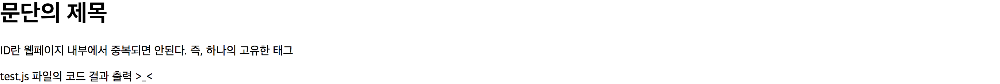
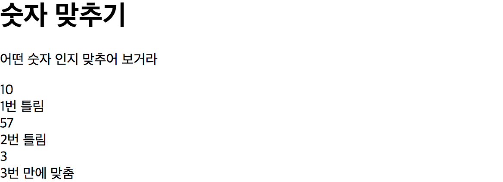

####DAY 11.

> **반복문**


1.  for - in

```javascript
var h = {name: "해나", status: "잠못잠", money: 9999999, age: 23, pc: 5,
		pet: ["애비추", "스누피", "가필드"],
		work: function(money) {
			this.money += money;
		}
	};

//1. 객체의 키와 값을 출력해 보자,
for (var x in h) {
	//h[x]는 h객체의 값을 보여준다.	
  console.log(x,h[x]);
}

//2. 객체 중에 숫자 객체의 합을 출력해 보자.
//이 변수가 for문 안에 들어가면 계속 초기화 되니까 밖에 선언하자.

//첫번째 방법
var sum = 0;
for (var y in h) {
  var v = h[y];
	if (typeof(v) === "number"){
		sum += v;
	}
}
console.log(sum);

//두번째(변수하나 줄이기)
var sum = 0;
for (var y in h) {
	if (typeof(h[y]) === "number") {
      sum += h[y];
	}
}
console.log(sum);
```

```javascript
//결과
//1번 결과
name 해나
status 잠못잠
money 9999999
age 23
pc 5
pet [ '애비추', '스누피', '가필드' ]
work function (money) {
			this.money += money;
		}

//2번 결과
10000027
```


2. while

* for : 얼마나 반복되는지 반복횟수를 알때 쓰임.

* while : 반복횟수를 모를 때 쓰임

  ​	     단순히 true, false의 조건으로 사용할 수 있다.

```javascript
//결과 0~5
var i = 0;
while (i<5) {
	console.log(i);
	i++;
}
console.log("last i = %d", i);

//결과 1~5
while (i<5) {
	i++;
	console.log(i);
}
console.log("last i = %d", i);
```


3. break , continue

```javascript
//berak
console.log("start");

for (var i = 0; i<5; i++) {
  console.log("1 %d", i);
  if (i == 3) {
    break; // i가 3이 되어 break를 만나면 루프가 더이상 돌지않고 종료된다.
  }
  console.log("2 %d", i);
}
console.log("end");

//continue (for의 경우 증감식으로 간다.)
console.log("start");

for (var i = 0; i < 5; i++) {
	console.log("1 %d", i);
	if (i >= 3) {
	// i가 3이 되어 continue를 만나면 아래 코드가 실행되지 않고 루프의 처음으로 돌아간다.	
      continue; 
	}
	console.log("2 %d", i);
}
console.log("end");
```


> **HTML**


1. HTML의 기본 형식

```html
<!DOCTYPE html>
<html lang = "ko">
<head>
 <meta charset = "utf-8">
</head>
<body>
 <h1>문단의 제목</h1>
 </div>
 <p id = "test">ID란 웹페이지 내부에서 중복되면 안된다. 즉, 하나의 고유한 태그</p>
 <script src = "test.js"> </script>
</body>
</html>
```

* html파일 작성 시 한글이 깨지는 현상을 해결해준다.

```
<head>
 <meta charset = "utf-8">
</head>
```

* 구역을 눈에 보이지 않지만 나눠준다.

```
</div>
```

* html문서 내에서 실행 가능한 스크립트를 참조하여 실행해준다.

```
 <script src = "test.js"> </script>
```


-- html파일 결과를 확인해보자.

****


2. 연습문제

1~100사이의 임의의 숫자를 생성하고 맞추는 게임을 작성
html + js로 작성
출력 내용은 html에 업뎃
숫자를 맞출 경우 시도한 횟수를 출력

```javascript
//htmltest.js 파일

var randomNum = Math.floor(Math.random() * 100) + 1;
console.log(randomNum);

var count = 0;

while (true) {
var inputNum = parseInt(prompt("숫자를 입력하세요."));
document.write(inputNum + "<br>");

	if (randomNum != inputNum) {
 		document.write(++count + "번 틀림" + "<br>");
		continue;
	} 
	break;
}
document.write(++count + "번 만에 맞춤");
```

```html
//htmltest.html 파일

<!DOCTYPE html>
<html lang = "ko">
<head>
 <meta charset = "utf-8">
</head>
<body>
 <h1>숫자 맞추기</h1>
 </div>
 <p id = "test">어떤 숫자 인지 맞추어 보거라</p>
 <script src = "htmltest.js"> </script>
</body>
</html>
```


— 결과



