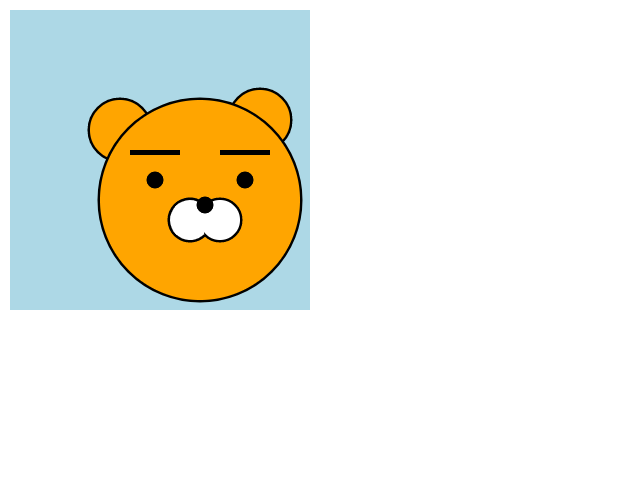

DAY 4.


> 함수

함수는 알듯 말듯...나중에 더 보충해야겠다.


```
var foo = function(n) {
  return n * 2
};
```

n : 매개변수

함수 선언 시점에선 값이 결정되지 않은 상태, 이 시점을 정해주는 것을 매개변수라 함


리턴 값이 있는 함수 : 리턴 값이 있을 경우에만 변수에 값을 대입(할당)할 수 있다.

리턴이 없는 함수 : 출력하면 undefined !


함수 작성하기 Tip.

줄수가 10줄 이상 넘어가면 함수로

인덴트가 지나치게 깊어져도 함수로

함수는 반드시 한 가지 일만


함수의 시그니쳐?

함수의 이름 , 매개변수, 리턴타입을 말함


함수 햇갈린다...일단 연습문제

문제 1.

```javascript
//배열의 첫번째 원소와 마지막 원소의 순서를 바꾸자
var arrSwap = function(arr) {
	var temp = arr[0];
	arr[0] = arr[arr.length - 1];
	arr[arr.length - 1] = temp;
}
var a = [1,2,3,4,5];
arrSwap(a);
console.log(a);
```

문제 2.

```javascript
//구구단을 출력하는 함수 만들기. 디폴트는 2단
var gugudan = function(dan=2) {
	for (var i = 1; i < 10; i++) {
		console.log("%d * %d = %d",dan,i,dan*i);
	}
};
gugudan();

```


> canvas


####카카오톡 캐릭터 라이언 그리기


- lion.html

  캔버스의 크기를 정한다

```
<canvas id="canvas" width="640" height="480"></canvas>
```

```html
<!DOCTYPE html>
<html lang="ko">
<head>
<meta charset="utf-8">
</head>
<body>
<canvas id="canvas" width="640" height="480"></canvas>
<script src="lion.js"> </script>
</body>
</html>
```


- lion.js

지정한 캔버스 크기 안에서 그림을 그릴 수 있다.

포토샵의 레이어 처럼 그리는 순서를 정하면, 그림을 위로 올리고 뒤로 보내면서 좀더 효율적인 작업이 가능하다.


원, 호 그리기(radian)

| 각도   | 지름   | 각도   | 지름   |
| ---- | ---- | ---- | ---- |
| 360° | 2𝜋  | 30°  | 𝜋/6 |
| 180° | 𝜋   | 45°  | 𝜋/4 |
| 90°  | 𝜋/2 | 60°  | 𝜋/3 |

```javascript
// 캔버스 장착!
var canvas = document.getElementById("canvas");
var ctx = canvas.getContext("2d");

//배경
ctx.fillStyle = "LightBlue"; // 바탕색 채우기
ctx.fillRect(10,10,300,300); // 바탕색을 채울 사각형 만들기(x,y,가로길이,세로길이)

//귀
ctx.lineWidth = 5; // 라인의 굵기
ctx.fillStyle = "orange";
ctx.beginPath(); // 새로운 시작점을 만들어 시작점 분리
// 호,원 그리기 / true=반시계방향,false=시계방향(디폴트)
ctx.arc(260,120,30,0,2*Math.PI,true); 
ctx.stroke(); // 그림의 라인을 입혀준다. 디폴트=black
ctx.fill(); // fillStyle 값을 여기까지 적용시켜준다.

ctx.beginPath();
ctx.arc(120,130,30,0,2*Math.PI,true);
ctx.stroke();
ctx.fill();

//얼굴
ctx.beginPath();
ctx.strokeStyle = "black";
ctx.arc(200, 200,100,0,2*Math.PI, true);
ctx.stroke();
ctx.fill();

//눈썹
ctx.beginPath();
ctx.strokeStyle = "balck";
ctx.fillStyle = "black";
ctx.fillRect(130,150,50,5);
ctx.stroke();

ctx.beginPath();
ctx.fillRect(220,150,50,5);
ctx.stroke();

//눈
ctx.beginPath();
ctx.arc(155,180,6,0,2*Math.PI);
ctx.stroke();
ctx.fill();

ctx.beginPath();
ctx.arc(245,180,6,0,2*Math.PI);
ctx.stroke();
ctx.fill();

//흰 원
ctx.beginPath();
ctx.strokeStyle = "balck";
ctx.fillStyle = "white";
ctx.arc(220,220,20,0,2*Math.PI);
ctx.stroke();
ctx.fill();

ctx.beginPath();
ctx.arc(190,220,20,-1,Math.PI/4,true);
ctx.stroke();
ctx.fill();

//코
ctx.beginPath();
ctx.strokeStyle = "balck";
ctx.fillStyle = "black";
ctx.arc(205,205,6,0,2*Math.PI);
ctx.stroke();
ctx.fill();
```


